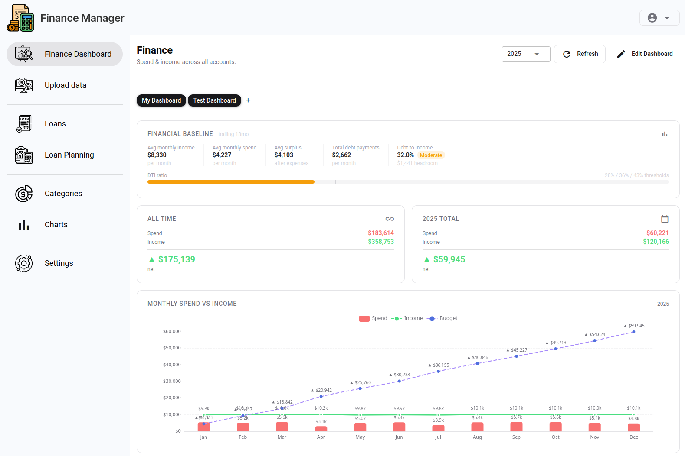
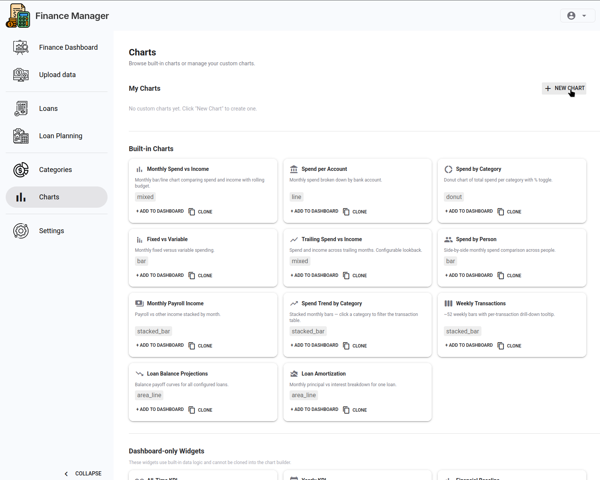
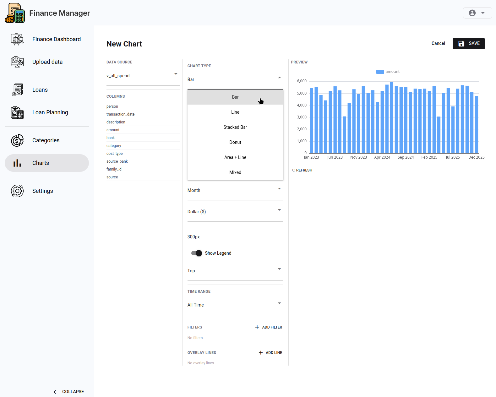
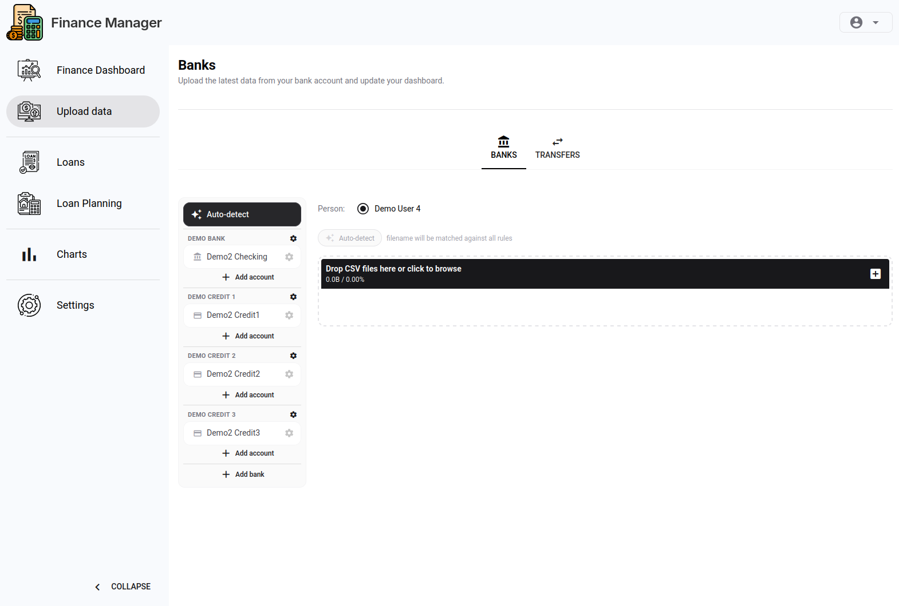
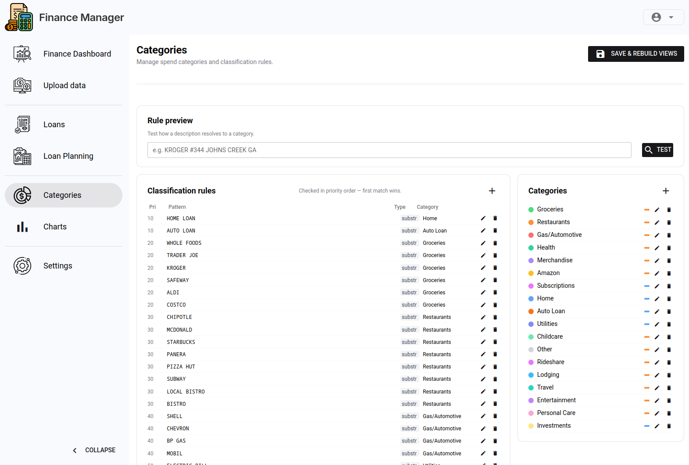
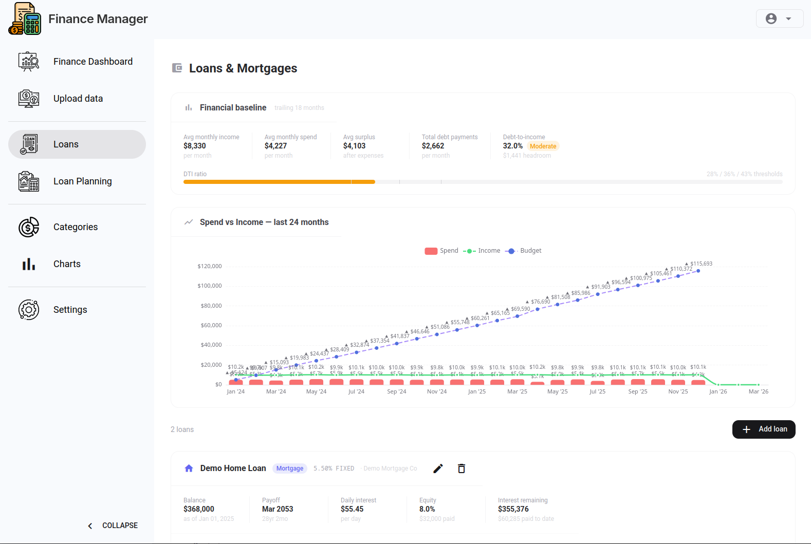
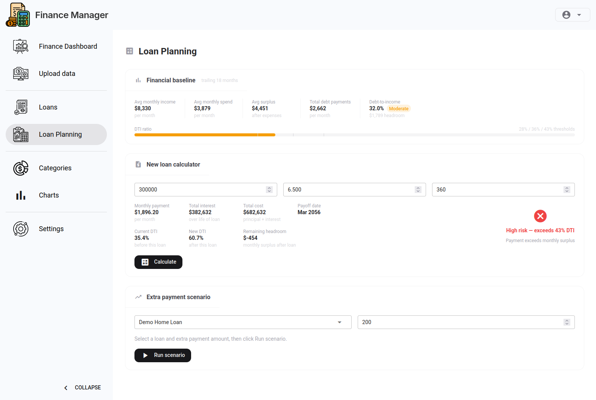
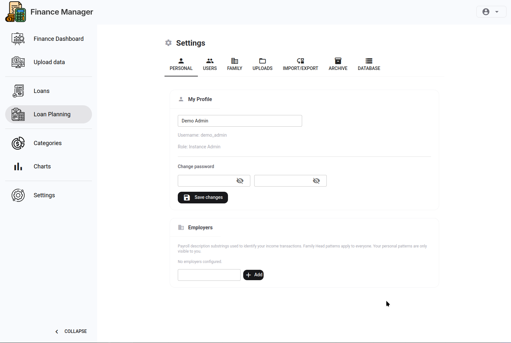

# Finance Manager

A self-hosted personal finance management app for households and families. Upload bank transactions, track spending patterns, manage loans, and explore your finances through a fully customisable dashboard — all running on your own infrastructure.

Built with **Python** (NiceGUI + FastAPI) and **PostgreSQL**. Deployed in two containers via Docker Compose.



---

## Demo Data

The app ships with a demo data script that seeds two complete families with 3 years of realistic transaction history, loans, bank rules, and category rules — useful for evaluating the app or showing it to others.

### Load demo data

```bash
docker exec -it finance-manager-app-1 python db_demo.py
```

This is idempotent — safe to run multiple times. Running it a second time does nothing if demo data is already present.

### Demo accounts

All demo accounts use the password **`demo`**.

| Username | Role | Family |
|----------|------|--------|
| `demo_admin` | Instance admin + family head | Demo Family 1 (healthy finances) |
| `demo_user_1` | Family member | Demo Family 1 |
| `demo_user_2` | Family member | Demo Family 1 |
| `demo_user_3` | Family head | Demo Family 2 (stretched finances) |
| `demo_user_4` | Family member | Demo Family 2 |
| `demo_user_5` | Family member | Demo Family 2 |

### Reset demo data

To wipe and re-seed from scratch (useful after experimenting with uploads or settings):

```bash
docker exec -it finance-manager-app-1 python db_demo.py --force
```

### Remove demo data

To remove all demo data and return to a clean state:

```bash
docker exec -it finance-manager-app-1 python db_demo.py --destroy
```

Add `--force` to skip the confirmation prompt.

### Sample CSV files

The script also generates sample CSV files under `demo/sample_csvs/` that you can upload through the UI to test the transaction import workflow. Each file covers Jan–Feb 2026 for one account.

---

## Features

### Customisable Finance Dashboard

Arrange KPI cards, bar charts, line charts, donut charts, data tables, and custom SQL-powered charts on a drag-and-drop grid. Each family gets their own saved layout.



- KPI cards for net spend, income, savings rate, and more
- Monthly spend trend charts (bar, line, or mixed)
- Category breakdown donut charts
- Per-account and per-person breakdowns
- **Custom chart builder** — write a SQL query and visualise it as any chart type



### Transaction Upload & Categorisation

Import CSV exports from your bank accounts. The upload pipeline:

1. Matches rows to your bank rule definitions (flexible regex-based matching)
2. Auto-categorises transactions using category rules
3. Deduplicates against previously imported data
4. Rebuilds all Postgres views so dashboards reflect the new data immediately



### Spending Category Management

Define and manage your own categories. Rules are regex patterns matched against transaction descriptions.



### Loan Tracking

Record loans with full amortisation schedules. Track remaining balance, paid-to-date, and projected payoff dates.



### Loan Planning

Model future loans before you take them. Adjust principal, interest rate, and term to compare repayment scenarios.



### Multi-user Families

One deployment serves multiple families in full isolation — no data ever crosses family boundaries.

| Role | What they can do |
|------|-----------------|
| **Family head** | Full control: upload transactions, manage members, configure dashboard and bank rules, export data |
| **Family member** | View dashboards and their own transaction data; upload to permitted accounts |
| **Instance admin** | Everything above, plus create/manage all families across the instance |

### Settings & Data Management

- Per-user profile and employer income pattern configuration
- Upload batch management (reassign person, delete batch)
- Full data export/import and config backup
- View refresh trigger
- Family management (admin)



---

## Quick Start

### Requirements

- Docker and Docker Compose

### 1. Create a `.env` file

```env
POSTGRES_PASSWORD=your_db_password
STORAGE_SECRET=your_session_secret

# Optional (defaults shown):
# POSTGRES_DB=finance-manager
# POSTGRES_USER=postgres
# TZ=UTC
```

### 2. Start the app

```bash
docker compose up -d
```

### 3. Create the first admin account

```bash
docker exec -it finance-manager-app-1 python db_migration.py \
  --admin-username admin@example.com \
  --admin-display-name "Your Name"
```

You will be prompted for a password.

4. Open the app

Navigate to [http://localhost:8080](http://localhost:8080) and log in.

> To rebuild after dependency changes: `docker compose up --build`

---

## Use Cases & Guides

Step-by-step guides for common workflows:

- [Getting Started](docs/use-cases/getting-started.md) — first login, family setup, and initial configuration
- [Uploading Transactions](docs/use-cases/uploading-transactions.md) — bank rules, CSV import, and categorisation
- [Customising the Dashboard](docs/use-cases/dashboard-customisation.md) — adding widgets, arranging layout, custom charts
- [Tracking Loans](docs/use-cases/loan-tracking.md) — adding loans and reading amortisation schedules
- [Setting Up Multiple Users](docs/use-cases/multi-user-setup.md) — inviting family members and managing roles

---

## Architecture

| Component | Technology | Port |
|-----------|-----------|------|
| App | NiceGUI + FastAPI (Python) | 8080 |
| Database | PostgreSQL 18 | 5432 |

### Data isolation

All data is scoped to a **family**. Every transaction row carries a `family_id`, and all queries filter by it. Users belong to one active family at a time.

### Transaction storage

Transactions are stored in two consolidated tables (`transactions_debit`, `transactions_credit`) with raw per-account archive tables (`raw_<account_key>`). Postgres views (`v_all_spend`, `v_credit_spend`, `v_debit_spend`, `v_income`, `v_transactions`) are rebuilt after each upload.

### Dashboard system

Dashboards are per-family and fully configurable. Widgets live in `app_dashboard_widgets`, referencing entries in the widget registry. A default layout is seeded when a new family is created.

---

## Local Development

Requires a local PostgreSQL instance.

```bash
cd app
python -m venv .venv
source .venv/bin/activate
pip install -r requirements.txt
python main.py
```

Migrations do **not** run automatically in dev mode. Call `run_migrations()` from `app/db_migration.py` manually if needed.

```bash
# Connect to the running container's DB
docker exec -it finance-manager-db-1 psql -U postgres -d finance-manager
```

---

## Testing

Integration tests spin up a throwaway Postgres container on port **5434** and roll back each test in a transaction.

```bash
cd app && .venv/bin/pytest ../tests/ -v
```

---

## Project Structure

```
app/
  main.py                 # Entry point: routing, layout, ui.run()
  pages/                  # One file per page, each exports content()
  services/               # Business logic (auth, uploads, loans, dashboard, etc.)
  components/             # Reusable UI components and dashboard widgets
  data/                   # DB connection, bank/category matching rules
  assets/                 # Static files (CSS, images, icons)
docs/
  screenshots/            # Page screenshots referenced in this README
  use-cases/              # Step-by-step workflow guides
```

---

## Key Dependencies

- [NiceGUI](https://nicegui.io) — Python UI framework
- [nicegui-echart](https://github.com/nicegui-community/nicegui-echart) — ECharts integration
- [SQLAlchemy](https://www.sqlalchemy.org) + [psycopg](https://www.psycopg.org) — PostgreSQL
- [pandas](https://pandas.pydata.org) — CSV processing
- [bcrypt](https://pypi.org/project/bcrypt/) — password hashing

---

## License

This project is licensed under the [MIT License](LICENSE).
