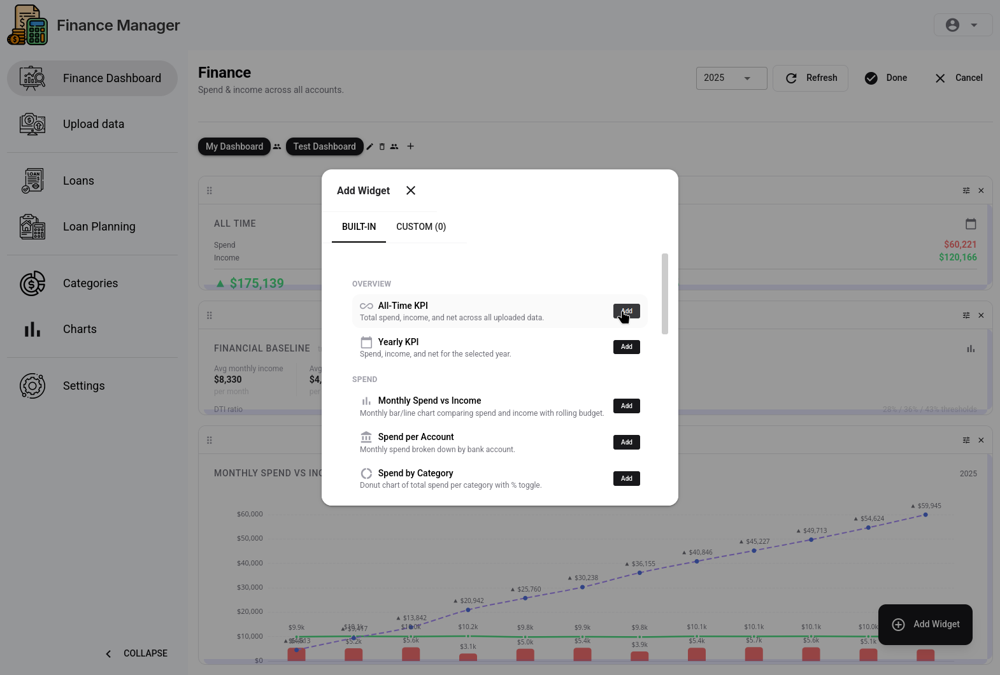
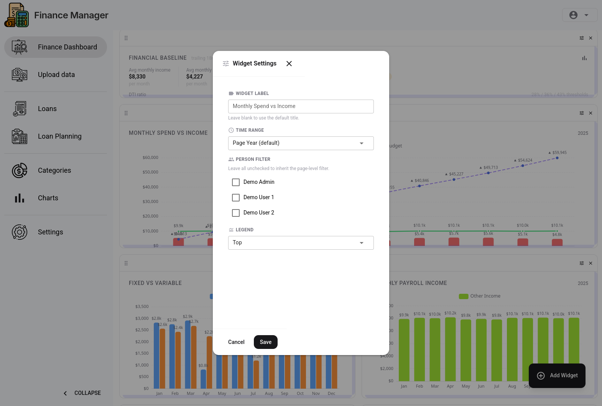

# Customising the Dashboard

The finance dashboard is a fully configurable grid of widgets. This guide explains how to add, arrange, and configure widgets — including building custom SQL charts.

## Overview

Each family has their own dashboard layout, saved automatically. When a family is first created, a default layout is seeded with a useful starting set of widgets.


## Adding Widgets

Click the **Add Widget** button (top-right of the dashboard). A dialog shows all available widget types:

| Category | Widget types |
|----------|-------------|
| KPI cards | Net spend, income, savings rate, per-category totals, and more |
| Charts | Monthly bar, line, mixed bar/line, donut category breakdown, per-person comparison |
| Tables | Transaction table with filters |
| Custom | Custom SQL chart — any query, any chart type |

Select a widget type and it is placed at the next available position on the grid.



## Arranging the Layout

Widgets can be freely **dragged** to reposition and **resized** by dragging the bottom-right corner. The grid compacts automatically to remove gaps.

Changes are saved as you make them — no explicit save step needed.

## Configuring a Widget

Click the **gear icon** on any widget to open its settings. Available options depend on the widget type, but commonly include:

- **Title** — override the default widget name
- **Date range** — last 3 months, last 12 months, year-to-date, all time, etc.
- **Account filter** — scope to specific bank accounts
- **Person filter** — scope to one family member
- **Chart type** — switch between bar, line, and mixed for applicable widgets



## Custom SQL Charts

The **Custom Chart** widget lets you write a SQL query and render the result as any chart type. This is useful for bespoke views that the built-in widgets don't cover.


### Available views

Your query can reference any of these Postgres views (all automatically scoped to your family):

| View | Contents |
|------|----------|
| `v_all_spend` | All debit + credit spend transactions |
| `v_credit_spend` | Credit card spend only |
| `v_debit_spend` | Checking/savings spend only |
| `v_income` | Income transactions |
| `v_transactions` | All transactions (spend + income) |

### Query format

The query must return columns that match the expected shape for the selected chart type. The builder shows the required columns for each chart type when you select it.

### Example: monthly grocery spend

```sql
SELECT
  to_char(date_trunc('month', transaction_date), 'Mon YYYY') AS month,
  SUM(amount) AS total
FROM v_all_spend
WHERE category = 'Groceries'
GROUP BY date_trunc('month', transaction_date)
ORDER BY date_trunc('month', transaction_date)
```

## Removing Widgets

Click the **X** button on a widget to remove it from the dashboard. This cannot be undone, but the widget type can always be re-added.

---

*Next: [Tracking Loans](loan-tracking.md)*
