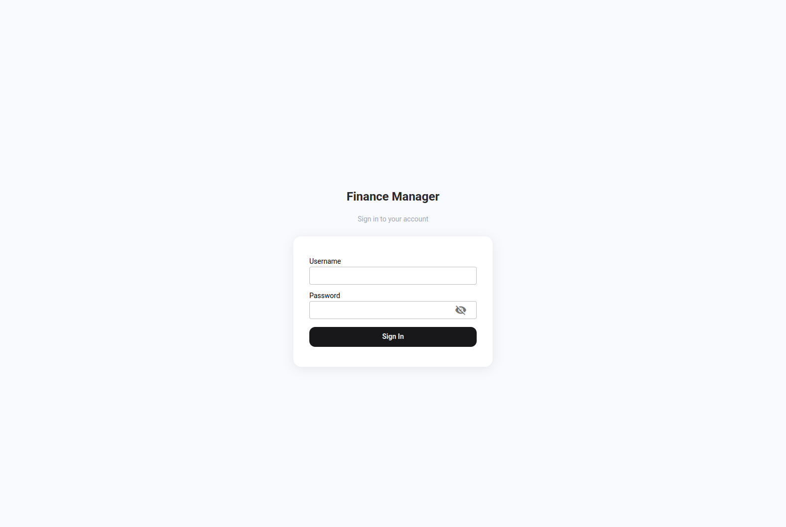
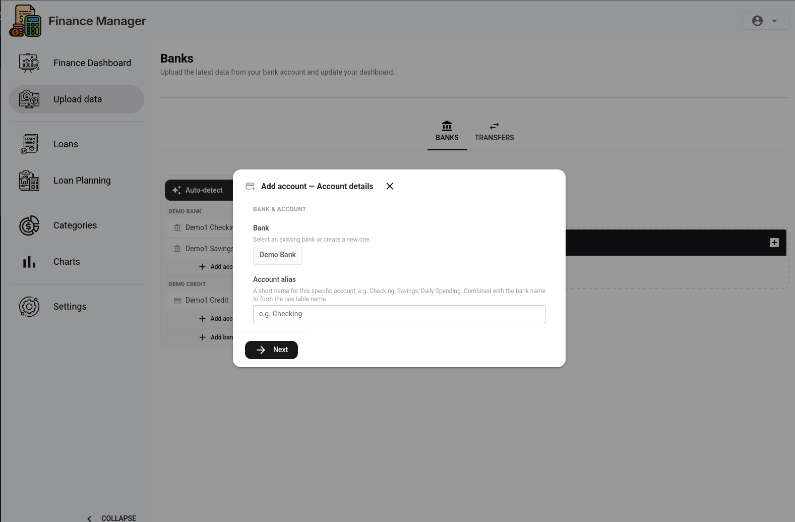
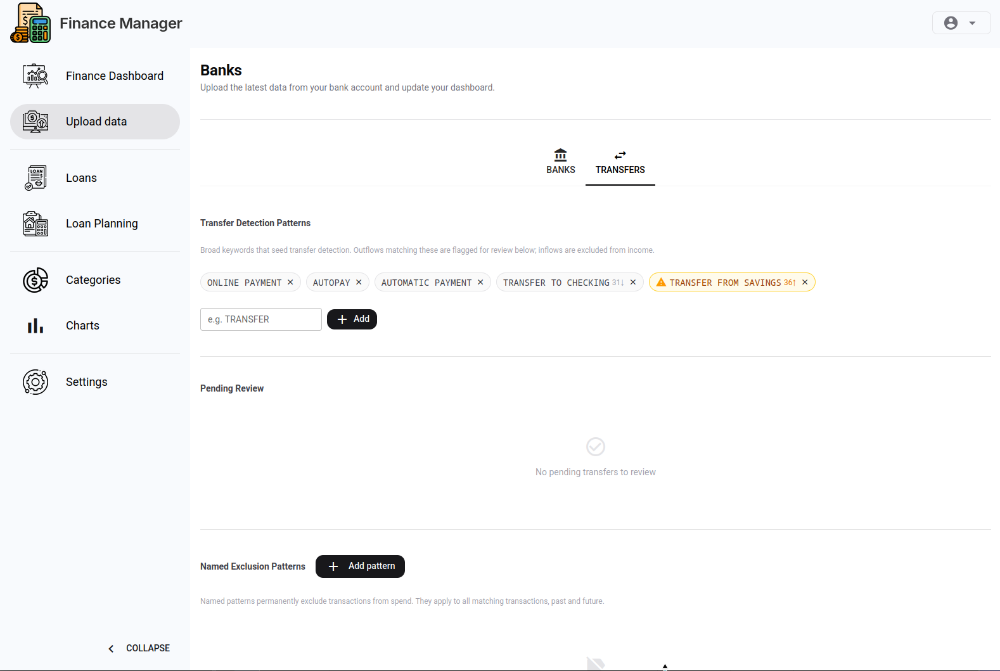

# Getting Started

This guide walks you through first login, creating your family, and initial configuration so you're ready to start tracking finances.

## 1. Create the First Admin Account

There is no self-registration UI. The first (admin) account must be created via the command line after the containers are running.

```bash
docker exec -it finance-manager-app-1 python db_migration.py \
  --admin-username admin@example.com \
  --admin-display-name "Your Name" \
  --admin-person "Your Name"
```

You will be prompted for a password. You can also pass it directly with `--admin-password`.

The `--full-setup` flag runs migrations first, then creates the user — useful if you haven't started the app yet:

```bash
docker exec -it finance-manager-app-1 python db_migration.py \
  --full-setup \
  --admin-username admin@example.com \
  --admin-display-name "Your Name"
```

Once created, log in at [http://localhost:8080](http://localhost:8080).



The instance admin has full access across all families on the instance.

## 2. Your Family is Created Automatically

After registering, a family is created for you automatically and you are set as its **head**. You can rename the family later in **Settings → Family**.

## 3. Add Your Bank Accounts

Before uploading transactions, you need to tell the app about each bank account you plan to import from. Go to the **Upload** page and use the **Add Account** wizard.

The wizard walks you through five steps:

1. **Account details** — choose the bank, give the account an alias, and select the account type (checking or credit)
2. **Upload a sample CSV** — upload a real export from your bank so the app can inspect its columns
3. **Column mapping** — confirm which columns map to date, description, and amount (the app pre-fills suggestions)
4. **Member aliases** — if the CSV includes a cardholder/member name column, map those names to family members (skipped if not applicable)
5. **Review & save** — confirm and save the bank rule



Repeat this for each account (e.g. joint checking, personal credit card, savings).

## 4. Configure Transfer Detection Patterns

On the **Upload** page, open the **Transfers** tab. Transfer Detection Patterns are keywords matched against outflows to identify internal transfers between your own accounts (e.g. moving money from checking to savings) so they are excluded from spending totals.

Add a pattern for each type of transfer description your bank uses (e.g. `Transfer`, `E-Transfer`, `Interac`).



The app will suggest additional patterns based on your uploaded transactions as it detects potential transfers.

## 5. Invite Family Members (optional)

If other people in your household will use the app, go to **Settings → Users** and create accounts for them. Assign them the **member** role (or promote to **head** if they should have full access).

See [Setting Up Multiple Users](multi-user-setup.md) for details.

## 6. Upload Your First Transactions

You're ready to import data. See [Uploading Transactions](uploading-transactions.md).

---

*Next: [Uploading Transactions](uploading-transactions.md)*
