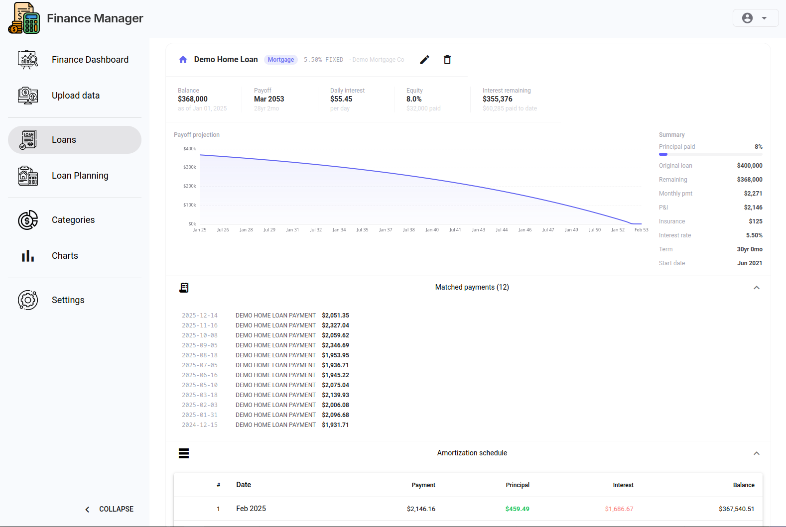

# Tracking Loans

Finance Manager can track any instalment loan — mortgages, car loans, personal loans — with a full amortisation schedule.

## Adding a Loan

Go to the **Loans** page and click **Add Loan**.

Fill in:

| Field | Description |
|-------|-------------|
| Name | A label for this loan (e.g. "Car loan — Toyota") |
| Principal | Original loan amount |
| Annual interest rate | As a percentage (e.g. `6.5`) |
| Term | Length in months |
| Start date | First payment date |
| Current balance | What you owe today (used to fast-forward the schedule if mid-loan) |

Click **Save**. The amortisation schedule is calculated immediately.

## Reading the Schedule

Each loan shows:

- **Remaining balance** — current outstanding principal
- **Next payment date** — when the next payment is due
- **Projected payoff date** — based on the original schedule
- **Total interest** — total interest paid over the life of the loan
- **Amortisation table** — month-by-month breakdown of principal vs interest

## Editing and Deleting Loans

Use the edit icon on any loan card to update details (e.g. if you refinanced or made an extra payment). Delete a loan to remove it entirely.

## Loan Planning

If you're considering a new loan and want to model repayments before committing, use the **Loan Planning** page instead. See [Loan Planning](loan-tracking.md#loan-planning) below, or navigate to the Loan Planning page directly.

---

## Loan Planning

The Loan Planning page is a what-if calculator — no data is saved.

Adjust the sliders or inputs for:

- **Principal** — how much you want to borrow
- **Annual interest rate**
- **Term** (months)

The projected monthly payment, total interest, and full amortisation table update in real time.

Use this to compare scenarios before taking on a new loan.

---

*Next: [Setting Up Multiple Users](multi-user-setup.md)*
