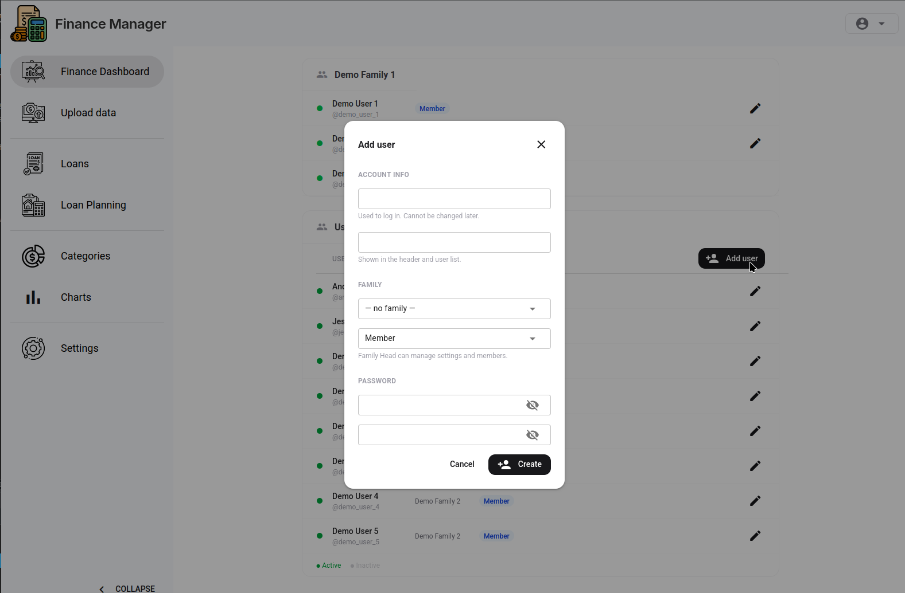
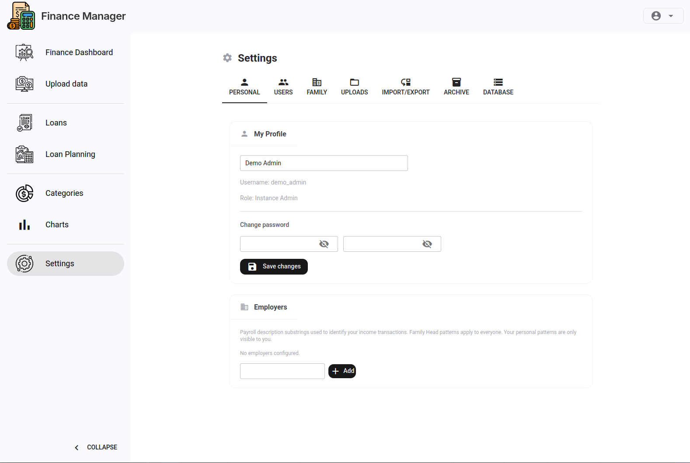

# Setting Up Multiple Users

Finance Manager supports multiple people in the same household sharing one family, with separate views of their own data and a shared family dashboard.

## Roles at a Glance

| Role | Upload | View own data | View all family data | Manage members | Admin across families |
|------|--------|--------------|---------------------|---------------|----------------------|
| Family member | Own accounts only | Yes | No | No | No |
| Family head | All accounts | Yes | Yes | Yes | No |
| Instance admin | All accounts | Yes | Yes | Yes | Yes |

## Creating Accounts for Family Members

> Only a **family head** or **instance admin** can create accounts.

Go to **Settings → Users** and click **Add User**.

Fill in:

- **Name** — display name shown in the UI
- **Email** — used as the login username
- **Password** — the user can change this after first login
- **Role** — `member` or `head`

The new user is automatically added to your family.

## Member vs Head

**Members** can:
- Log in and view the family dashboard
- See their own transaction data in filtered views
- Upload to bank accounts they are assigned to

**Heads** can do everything a member can, plus:
- Upload to any account
- Manage family members (add, remove, change roles)
- Configure bank rules and category rules
- Delete or reassign upload batches
- Export and import data
- Refresh views

## Employer Income Patterns

Each user can configure **employer patterns** in **Settings → Personal**. These are regex patterns matched against income transactions to identify salary deposits.

- Patterns added by a member are owned by that member — only they (or a head) can remove them.
- Patterns added by a head with no owner are family-level and protected from member removal.

## Per-person Dashboard Breakdowns

When multiple people are in a family, many widgets support a **person filter** to show spend or income for one person only. This is useful for splitting household finances between partners.

## Removing a Member

Go to **Settings → Users**, find the member, and click **Remove**. Their transaction data remains in the family's history — only the account is removed from the family.

---

*Back to [Getting Started](getting-started.md)*
