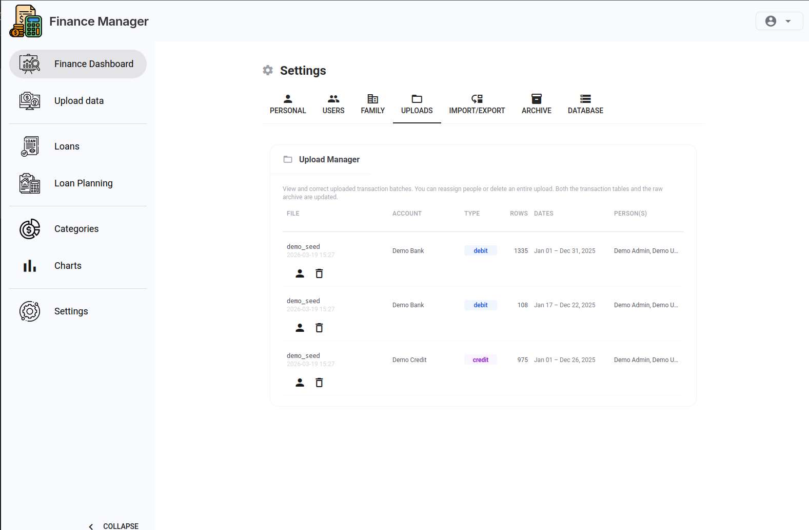

# Uploading Transactions

This guide covers importing CSV exports from your bank and getting them categorised.

## Prerequisites

- At least one bank rule configured (see [Getting Started](getting-started.md))
- A CSV export from your bank account

## 1. Export a CSV from Your Bank

Most banks offer a CSV download from the transaction history page. The exact steps vary by institution. Download the file to your computer.

## 2. Upload the File

Go to the **Upload** page and select your CSV file. Choose the correct bank rule from the dropdown — this tells the pipeline which columns to read and which account to associate the transactions with.

Click **Upload**. The pipeline will:

1. Parse the CSV using your bank rule's column mappings
2. Match each row against category rules and assign a category
3. Deduplicate against previously imported transactions (using a per-account constraint)
4. Insert new transactions into the consolidated tables
5. Archive raw rows to the per-account table (`raw_<account_key>`)
6. Rebuild all Postgres views so dashboard data is immediately up to date

A summary shows how many rows were imported, skipped (duplicates), and rejected (parse errors).

## 3. Review Uncategorised Transactions

After upload, any transactions that didn't match a category rule are left as uncategorised. Review them in the dashboard transaction table and add category rules to catch them on the next upload.

## 4. Managing Upload Batches

Each upload creates a batch record. In **Settings → Uploads** you can:

- **Reassign person** — if you uploaded to the wrong person's account
- **Delete batch** — removes all transactions from that import

## Tips

- Keep your CSV exports in a consistent date range. Duplicates are silently skipped, so overlapping ranges are safe.
- If a parse fails, check that the selected bank rule matches the CSV column layout.
- After fixing category rules, you can re-trigger view refresh from **Settings → Data** without re-uploading.

---

*Next: [Customising the Dashboard](dashboard-customisation.md)*
